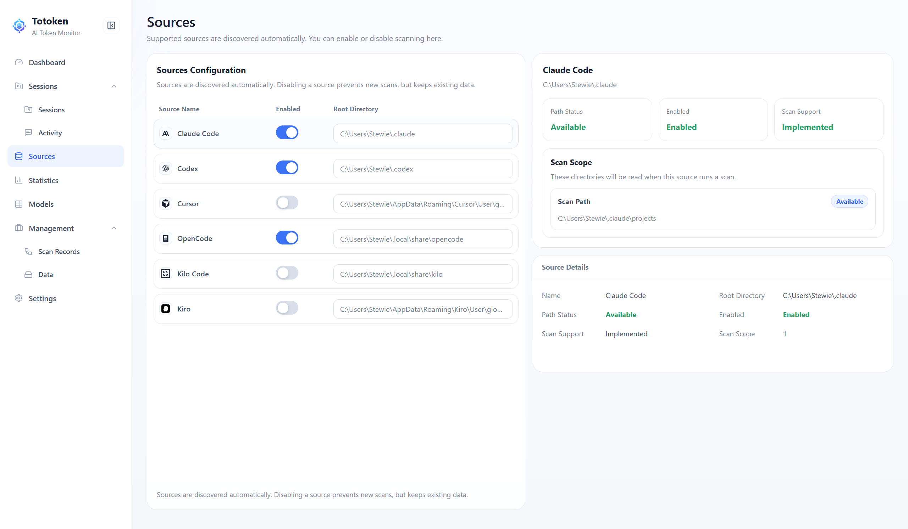
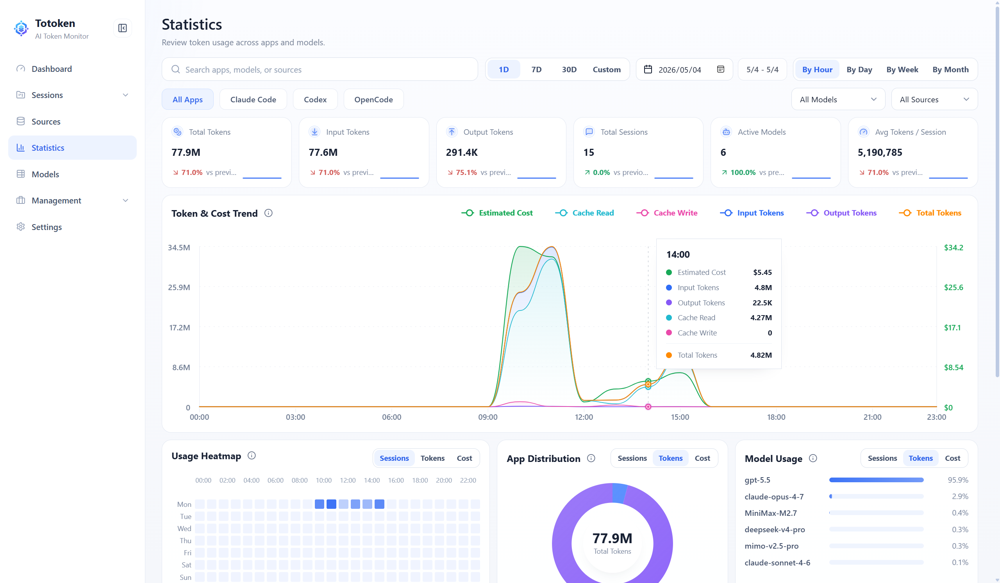

<div align="center">
  <h1>Totoken</h1>
  <p><strong>Local AI coding tool usage inspector</strong></p>
  <p>Inspect sessions, tokens, models, scans, and statistics from supported desktop AI coding tools.</p>
  <p>
    <a href="README.zh-CN.md">简体中文</a>
  </p>
  <p>
    <a href="LICENSE"></a>
    <a href="https://tauri.app/"></a>
    <a href="https://react.dev/"></a>
    <a href="https://www.rust-lang.org/"></a>
    <a href="https://www.typescriptlang.org/"></a>
  </p>
</div>

Totoken is a desktop application for inspecting local AI coding tool activity. It scans supported tools on your machine, stores normalized session and token data locally, and provides dashboards for usage, sessions, messages, models, scans, and app data maintenance.

The project currently focuses on local usage visibility. It does not run a model gateway, proxy provider traffic, or manage external API credentials.

## Screenshots





## Features

- Usage dashboard with token totals, estimated cost, scan status, and recent activity.
- Source management for Claude Code, Codex, Cursor, OpenCode, Kilo Code, and Kiro.
- Session and message views for browsing local AI tool history.
- Statistics views for token trends, source distribution, model usage, activity heatmaps, and cost estimates.
- Model catalog sync from OpenRouter, including metadata, context windows, capabilities, and pricing.
- Scan records for reviewing manual and scheduled scans.
- App data tools for inspecting the local data directory, backups, cache cleanup, database vacuum, and index rebuilds.
- Settings for scan scheduling, storage location, UI theme, language, notifications, and localized token units.
- English and Simplified Chinese interface strings.

## Model Catalog Data

Totoken uses OpenRouter's Models API as a third-party source for model metadata such as model names, context windows, capabilities, supported parameters, and pricing. The catalog is used for display and local cost estimation only.

Totoken is not affiliated with, sponsored by, or endorsed by OpenRouter. Model metadata and pricing can change over time, so estimates should be treated as informational rather than billing records.

## Tech Stack

- Desktop runtime: Tauri 2
- Frontend: React 18, TypeScript, Vite
- Backend: Rust
- Storage: SQLite via `rusqlite`
- Package manager: pnpm 10

## Platform Support

Totoken targets the three major desktop platforms:

| Platform                   | Status    | Release asset |
| -------------------------- | --------- | ------------- |
| Windows 10/11 x64          | Supported | MSI           |
| macOS 10.15+ Intel         | Supported | DMG           |
| macOS 10.15+ Apple Silicon | Supported | DMG           |
| Linux x64 (X11 / Wayland)  | Supported | DEB, AppImage |

Application data is stored under `~/.totoken/` on every platform. On Windows this is usually `C:\Users\<you>\.totoken`.

## Requirements

- Node.js 22+
- pnpm 10+
- Rust stable toolchain
- Tauri 2 platform prerequisites for your OS

See the [Tauri prerequisites guide](https://v2.tauri.app/start/prerequisites/) for system setup.

### Linux Packages

For Debian/Ubuntu development and CI builds:

```bash
sudo apt-get install -y \
  libwebkit2gtk-4.1-dev \
  libayatana-appindicator3-dev \
  librsvg2-dev \
  patchelf \
  libdbus-1-dev \
  pkg-config
```

## Development

Install dependencies:

```bash
pnpm install
```

Run only the frontend dev server:

```bash
pnpm dev
```

Run the Tauri desktop app in development mode:

```bash
pnpm tauri:dev
```

`pnpm tauri:dev` uses `src-tauri/tauri.dev.conf.json`, which adds the Vite localhost entries required by development CSP. Production builds use the stricter CSP in `src-tauri/tauri.conf.json`.

## Build

Build the frontend:

```bash
pnpm build
```

Build the current platform with Tauri:

```bash
pnpm tauri:build
```

Platform-specific helpers:

```bash
pnpm tauri:build:windows
pnpm tauri:build:mac
pnpm tauri:build:linux
```

The release workflow builds Windows MSI, macOS DMG, Linux DEB, and Linux AppImage artifacts when a `v*` tag is pushed.

## Quality Checks

Frontend checks:

```bash
pnpm lint
pnpm format:check
pnpm test
pnpm build
```

Rust checks:

```bash
pnpm rust:fmt
pnpm rust:clippy
cd src-tauri
cargo test
```

## Release

Releases are created by pushing a version tag:

```bash
git tag v0.1.0
git push origin v0.1.0
```

The GitHub Release name and tag come from the pushed tag, for example `Totoken v0.1.0`. Keep the tag aligned with the app version in `package.json`, `src-tauri/Cargo.toml`, and `src-tauri/tauri.conf.json`.

Current release artifacts:

- Windows x64: `.msi`
- Linux x64: `.deb`, `.AppImage`
- macOS Intel: `.dmg`
- macOS Apple Silicon: `.dmg`

## Project Structure

```text
src/                  React application source
src/app/              Router and app-level wiring
src/components/       Shared UI components
src/i18n/             Locale messages and formatting helpers
src/layouts/          Application shell layout
src/lib/              Frontend utility modules
src/pages/            Dashboard, sessions, messages, sources, statistics, models, settings
src/styles/           Global styles, design tokens, shared controls
src/theme/            Theme provider and theme definitions
src-tauri/            Tauri and Rust backend
src-tauri/src/commands/  Tauri command handlers
src-tauri/src/db/        SQLite setup, migrations, and repositories
src-tauri/src/sources/   Parsers for supported AI coding tools
scripts/              Local project checks
docs/                 Local design notes
archive/              Ignored staging area for removed features
```

## License

Totoken is licensed under the MIT License. See [LICENSE](LICENSE) for details.
