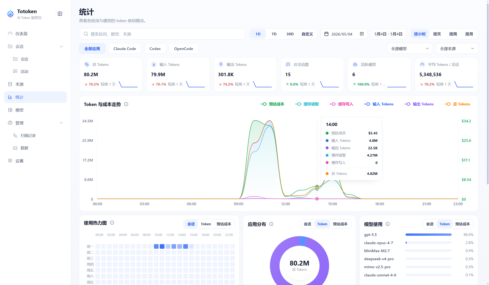
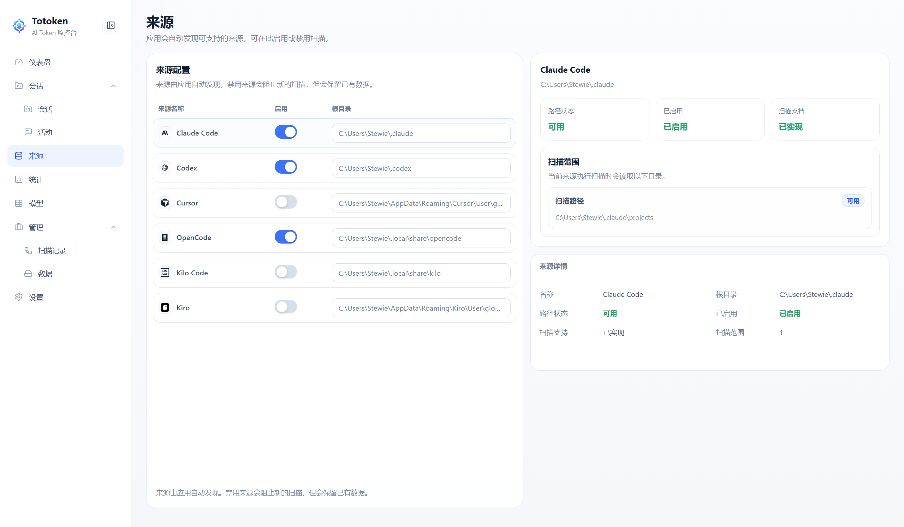

<div align="center">
  <h1>Totoken</h1>
  <p><strong>查看本地 AI 编程工具的会话、Token 用量和费用估算。</strong></p>
  <p>
    <a href="README.md">English</a>
  </p>
  <p>
    <a href="https://github.com/looplock/Totoken/actions/workflows/ci.yml"></a>
    <a href="https://github.com/looplock/Totoken/releases/latest"></a>
    <a href="https://github.com/looplock/Totoken/releases"></a>
    <a href="LICENSE"></a>
    <a href="https://tauri.app/"></a>
    <a href="https://react.dev/"></a>
    <a href="https://www.rust-lang.org/"></a>
    <a href="https://www.typescriptlang.org/"></a>
  </p>
</div>

Totoken 是一个用于查看本地 AI 编程工具活动的桌面应用。它会扫描本机已支持工具的数据，保存标准化后的会话与 Token 使用记录，并提供用量、会话、消息、模型、扫描记录和应用数据维护等视图。

当前项目聚焦本地用量可视化，不提供模型网关、不代理供应商流量，也不管理外部 API 凭据。

## 下载

请从 [Releases](https://github.com/looplock/Totoken/releases) 页面下载最新桌面安装包。

- Windows x64：MSI
- macOS Intel / Apple Silicon：DMG
- Linux x64：DEB 或 AppImage

Totoken 是本地桌面应用。普通用户不需要安装 Node.js、pnpm、Rust 或 Tauri 工具链。

## 界面预览





## 功能

- 用量仪表盘：查看 Token 总量、费用估算、扫描状态和近期活动。
- 来源管理：支持 Claude Code、Codex、Cursor、OpenCode、当前 Kilo Code VS Code 插件和 Kiro。
- 会话与消息视图：浏览本地 AI 工具历史记录。
- 统计视图：查看 Token 趋势、来源分布、模型用量、活动热力图和费用估算。
- 模型目录：从 OpenRouter 同步模型元数据、上下文窗口、能力和价格信息。
- 扫描记录：查看手动扫描和计划扫描的执行结果。
- 应用数据工具：查看本地数据目录、备份、缓存清理、数据库 vacuum 和索引重建。
- 设置：配置扫描计划、存储位置、界面主题、语言、通知和本地化 Token 单位。
- 英文和简体中文界面文案。

## 模型目录数据

Totoken 使用 OpenRouter 的 Models API 作为第三方模型元数据来源，用于获取模型名称、上下文窗口、能力、支持参数和价格等信息。模型目录仅用于展示和本地费用估算。

Totoken 与 OpenRouter 没有关联、赞助或背书关系。模型元数据和价格可能随时间变化，因此费用估算只应作为参考信息，不应视为账单记录。

## 隐私与数据

Totoken 会读取已支持 AI 编程工具的本地历史文件，并将标准化后的数据存储在本机 `~/.totoken/` 下。

它不会上传你的会话、消息、提示词、代码或 API 凭据。仅当你选择同步模型目录时，才会访问 OpenRouter 以获取模型元数据，用于展示和本地费用估算。

## 技术栈

- 桌面运行时：Tauri 2
- 前端：React 18、TypeScript、Vite
- 后端：Rust
- 存储：SQLite，通过 `rusqlite` 使用
- 包管理器：pnpm 10

## 平台支持

Totoken 面向三大桌面平台：

| 平台                       | 状态   | 发布产物      |
| -------------------------- | ------ | ------------- |
| Windows 10/11 x64          | 已支持 | MSI           |
| macOS 10.15+ Intel         | 已支持 | DMG           |
| macOS 10.15+ Apple Silicon | 已支持 | DMG           |
| Linux x64（X11 / Wayland） | 已支持 | DEB、AppImage |

应用数据在所有平台上都位于 `~/.totoken/`。在 Windows 上通常是 `C:\Users\<你>\.totoken`。

## 环境要求

- Node.js 22+
- pnpm 10+
- Rust stable 工具链
- 当前系统对应的 Tauri 2 平台依赖

系统依赖请参考 [Tauri 平台依赖指南](https://v2.tauri.app/start/prerequisites/)。

### Linux 系统包

Debian/Ubuntu 开发和 CI 构建需要：

```bash
sudo apt-get install -y \
  libwebkit2gtk-4.1-dev \
  libayatana-appindicator3-dev \
  librsvg2-dev \
  patchelf \
  libdbus-1-dev \
  pkg-config
```

## 开发

安装依赖：

```bash
pnpm install
```

只运行前端开发服务器：

```bash
pnpm dev
```

以开发模式运行 Tauri 桌面应用：

```bash
pnpm tauri:dev
```

`pnpm tauri:dev` 会使用 `src-tauri/tauri.dev.conf.json`，其中包含 Vite localhost 所需的开发 CSP。生产构建使用 `src-tauri/tauri.conf.json` 中更严格的 CSP。

## 构建

构建前端：

```bash
pnpm build
```

使用 Tauri 构建当前平台：

```bash
pnpm tauri:build
```

平台构建辅助命令：

```bash
pnpm tauri:build:windows
pnpm tauri:build:mac
pnpm tauri:build:linux
```

Release workflow 会在推送 `v*` tag 时构建 Windows MSI、macOS DMG、Linux DEB 和 Linux AppImage。

## 质量检查

前端检查：

```bash
pnpm lint
pnpm format:check
pnpm test
pnpm build
```

Rust 检查：

```bash
pnpm rust:fmt
pnpm rust:clippy
cd src-tauri
cargo test
```

## 发布

推送版本 tag 即可创建 Release：

```bash
git tag v0.1.0
git push origin v0.1.0
```

GitHub Release 的名称和 tag 来自推送的 tag，例如 `Totoken v0.1.0`。发布前请保持 tag 与 `package.json`、`src-tauri/Cargo.toml`、`src-tauri/tauri.conf.json` 中的应用版本一致。

当前发布产物：

- Windows x64：`.msi`
- Linux x64：`.deb`、`.AppImage`
- macOS Intel：`.dmg`
- macOS Apple Silicon：`.dmg`

## 项目结构

```text
src/                      React 应用源码
src/app/                  路由和应用级装配
src/components/           共享 UI 组件
src/i18n/                 多语言文案和格式化工具
src/layouts/              应用外壳布局
src/lib/                  前端工具模块
src/pages/                仪表盘、会话、消息、来源、统计、模型、设置等页面
src/styles/               全局样式、设计 token 和共享控件样式
src/theme/                主题 Provider 和主题定义
src-tauri/                Tauri 与 Rust 后端
src-tauri/src/commands/   Tauri 命令处理
src-tauri/src/db/         SQLite 初始化、迁移和仓储
src-tauri/src/sources/    已支持 AI 编程工具的数据解析器
scripts/                  本地项目检查脚本
docs/                     本地设计文档
archive/                  被移除功能的忽略暂存目录
```

## 贡献

Bug 反馈、Pull Request 提交流程和本地检查命令见 [CONTRIBUTING.md](CONTRIBUTING.md)。

## 许可证

Totoken 使用 MIT License。详情见 [LICENSE](LICENSE)。
